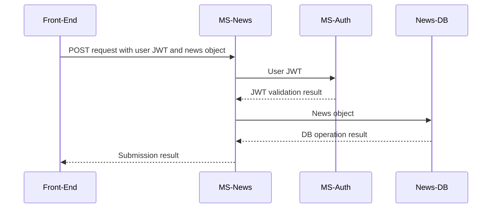
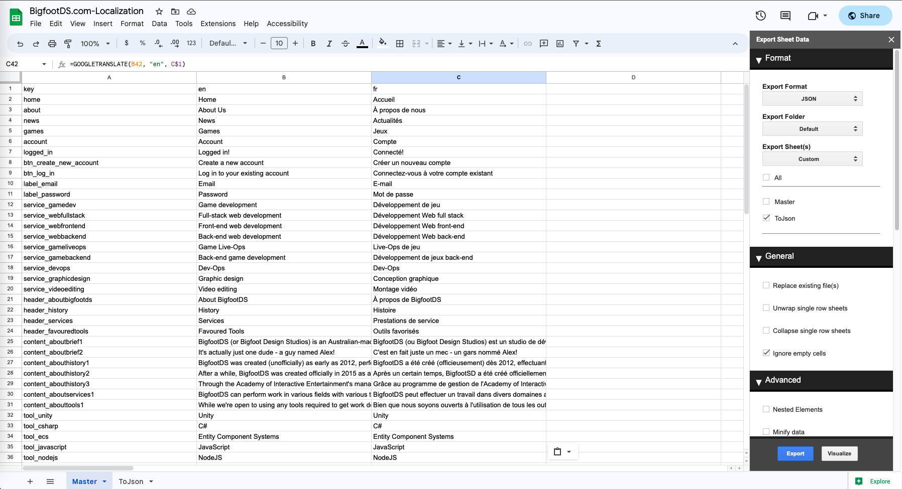
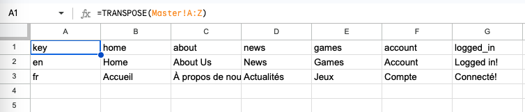

# BigfootDS Web App

A single-page application made in ReactJS.

Data fetched from various BigfootDS microservices.

- Translation (& hopefully localisation) via [react-18next](https://react.i18next.com/guides/quick-start)
- SPA routing via [React Router](https://reactrouter.com/en/main/start/tutorial)
- Local storage via [react-use](https://github.com/streamich/react-use)

## Purpose

Purpose of the repo: education!

Purpose of the web-app: business!

I need a web client for the back-ends that I'm building so that my customers (of my videogames) can do appropriate things with their game data.

Since I'm a full-time teacher (not a full-time game developer), building this as a classroom example means that:

1. I can create time to work on this thing.
2. I can show students some cool functionalities and ways of working.

The repository of this front-end web-app is publicly visible since it holds no API keys or other sensitive data - the back-end servers / microservices will remain private though, as they do have keys and security logic that would become useless if it were public. White-label projects of the back-ends will be made during classes, it's really not special - but things like the JWT decryption keys cannot be shared.

## Pages

The routes accessible across the front-end application.

### /

Homepage, shows some general information about BigfootDS products.


### /about

"About Us" page, shows more information about BigfootDS such as its history and services.

Basically a static page.


### /games

"Games" page that shows more information about BigfootDS products.

Basically a static page.


### /news

** NOT YET IMPLEMENTED **

Should pull posts from the MS-News microservice.
Read-only for all but the admin users, who can do full CRUD on the website to manage and create news posts.

Interacts with MS-News.


### /account/:userId

** NOT YET IMPLEMENTED **

Page to view account data.
Contains data from a combination of microservices, so this page must contain distinct components for those.

eg.
```
- /account/:userId
	- component to view data from MS-Auth specific to userId
	- component to view data from MS-Accounts specific to userId
```
Additionally, there is frontend logic to reveal editable forms.

- When user views their own account, edit/delete buttons appear on the relevant data
- When user views someone else's account, the viewed data is read-only

The back-end also has logic to prevent unauthorized edits, so the above logic is purely for UX.

### /account/:userId/:profileId/edit

** NOT YET IMPLEMENTED **

Shows profile CRUD form.

Interacts with MS-Accounts.


### /account/signup

Shows the auth register form.

Interacts with MS-Auth.


### /account/login

Shows the auth login form.

Interacts with MS-Auth.


## Contexts

Data managers across the front-end application.

### AuthContext

Data and CRUD interactivity with the MS-Auth microservice.

Uses a custom async reducer so that fetch requests can be used within reducer dispatch operations.

Bit of a doozy, this context does two things:

- manage sessions about the human using the front-end (eg. JWT management with the MS-Auth microservice)
- perform CRUD with the MS-Auth microservice

Manages two types of JWTs for different actions, as some actions should require a more-recent login.

For example, a user can log in once a month and stay logged in for general account data interactions, which uses the "long" JWT for a long-lived session. For more-sensitive operations such as changing a user's email address, a "short" JWT should be used to confirm that a real human logged in recently (as this would be a "short-lived" JWT).

And for CRUD operations, a valid JWT must be attached as well as whatever CRUD data is to be acted upon. 

For example, editing a user's email address would require both a short-lived JWT as well as a body of data including the email address.

For example, viewing a different user's data would require no JWT but does require a body of data including a target user ID.


### ProfileContext

Data and CRUD interactivity with the MS-Accounts microservice.

Uses a custom async reducer so that fetch requests can be used within reducer dispatch operations.

Manages profile data specified by routes in the front-end application, basically performing CRUD with the MS-Accounts microservice.

Most actions will require a valid JWT as well as profile-related body data, which the MS-Accounts microservice will automatically validate with MS-Auth.


### ThemeContext

The context itself just stores the name of the active theme, but the provider component of this context interacts with predefined, hardcoded objects that match those names and applies their values to the HTML document.

By using this context data to change CSS variables, we can set an active theme to the website. However, all CSS related to colours must use only those CSS variables - if it's not a variable, it won't be affected by the theme system.

The `ThemeBar` component just provides a way to read and change the name of the active theme, but it has no awareness of the CSS colours or theme data beyond that. All of the good stuff happens in the context file.

Context file here:
- [src/contexts/ThemeContext.js](./src/contexts/ThemeContext.js)

Example of CSS usage:

```css
.gameInfoCard {
	background-color: var(--light);
	margin: 2%;
	padding: 2%;
	display: flex;
	flex-direction: column;
}
```

### LanguageContext

This context system relies heavily on the [react-i18next](https://react.i18next.com/guides/quick-start) NPM package. It's a fantastic package and makes localisation really straightforward to work through.

The default data of this context is irrelevant, as the i18n system will apply itself to the app as early as possible with all relevant data instead. So, this context system is really just a way for us to interact with the `i18n` system - specifically, to read the active language and change the active language at runtime.

Context file here:
- [src/contexts/LanguageContext.js](./src/contexts/LanguageContext.js)

Some notable code related to this system:

- To know which languages are localised by the app, we read the data from `Object.keys(i18n.services.resourceStore.data)` -- the array returned by `Object.keys()` is an array of ISO 639-1 language identifiers such as "en" for "English" and "fr" for "French".

- The `LanguageBar` component just changes which ISO 639-1 identifier is set as `i18n`'s active language. The `i18n` system automatically handles language resource swapping based on that value.

- The rest of the app - meaning, everything that isn't the `LanguageBar` does not interact with this context system. It interacts with the `i18n` system instead, as it provides hooks to translate content for the React app to use.

You can read more about how this app uses the `i18n` system in the [Localisation](#localisation) section below.

## Security

Because this is a front-end, client-side-only web application - security is not bulletproof.

Meaning that there are forms and pages that are inaccessible based on client-side data.

Client-side data can always be edited, and should never be the "source of truth" for authentication or authorization.

So, the client-side data is never acted upon without server-side verification. 

For example, if a user "hacks" the browser to show a news CRUD form - something that is normally only accessible by admins - and makes a new news post using that form, the back-end microservice "MS-News" will receive the submission from that form. The "MS-News" microservice expects a JWT to be attached to the submission - and it passes that JWT onwards to "MS-Auth" for verification and refreshing. If "MS-Auth" says the JWT is invalid or if the JWT is associated with a user that does not have the correct permissions (no, the JWT does not store roles/permissions within it - just the user ID), "MS-News" halts its operation and returns an error to the front-end.

If "MS-Auth" said that the user specified in the JWT has the correct access permissions _and_ that the JWT is valid, a fresh JWT will be generated and returned to the previous layer (eg. "MS-News"). Then, "MS-News" can act upon the submission that it received.





## Localisation

The website features translated content, with plans to do more-thorough localisation when appropriate in future.

This is done through numerous steps:

1. Create a Google Sheet with each string of content as a new row item.
2. Use a Google Sheet cell formula to automatically translate the English string into another language, with manual translation done if the automatic translation isn't suitable (manual translation removes the formula from the cell though!).
3. Use a Google Sheet sheet formula to transpose the easy-to-manage data sheet into an easy-to-process data sheet.
4. Use a Google Sheet extension "Export Sheet Data" to periodically generate JSON data based on the transposed data sheet, as the transposed data converts into a usable JSON structure for the React app.
5. Use `react-i18next` to implement the JSON data throughout the React app.

Screenshot is best viewed at fullscreen, as it shows:
- the formula for translating a cell automatically
- the settings used in the "Export Sheet Data" extension
- the syntax and layout of the easy-to-manage data sheet



Screenshot shows the transposed data sheet, which is the target used in the "Export Sheet Data" extension. Note the cell formula, transposing the "Master" sheet.



To see how the `react-i18next` implementation is performed, please explore these files:

- to see the stored JSON data structure:
	- [./src/assets/localization/BigfootDSLanguages.json](./src/assets/localization/BigfootDSLanguages.json)
- to establish correct i18n configuration to load the above JSON data:
	- [./src/i18n.js](./src/i18n.js)
- to establish app-wide access to language selection system:
	- [./src/contexts/LanguageContext.js](./src/contexts/LanguageContext.js)
- to establish UI for language selection
	- [./src/components/LanguageBar.jsx](./src/components/LanguageBar.jsx)
- to see how translated content is implemented in a contente-heavy component
	- [./src/pages/AboutUs.jsx](./src/pages/AboutUs.jsx)


## Deployment

This project uses GitHub Actions to automatically deploy the ReactJS app to a live domain. You can view the workflow file here:

- [.github/workflows/cd.yml](.github/workflows/cd.yml)

The repository is set up to "Deploy from a branch" using the `gh-pages` branch, making its contents publicly accessible through the GitHub Pages web hosting system.

The GitHub Pages system for this repository is also configured with custom domain name usage.

- [https://web-staging.bigfootds.dev/](https://web-staging.bigfootds.dev/)

Technically, the web app is also available on the default GitHub Pages URL, but it does not work on that URL since it needs additional ReactJS configuration.

- [https://bigfootds.github.io/Web-BigfootDS/](https://bigfootds.github.io/Web-BigfootDS/)

Because that URL hosts the app in a subdirectory or route (the "Web-BigfootDS" part), the React app breaks - default ReactJS app settings expects the ReactJS app to be hosted at the root of a domain name.

Due to GitHub Pages limitations as of May 2023, it's not possible to make a GitHub Pages website available on multiple custom domains. Additional work will be needed to move this website from "web-staging.bigfootds.dev" to "bigfootds.com" when the time for that comes along. Of course, we could just skip a staging domain entirely and push straight to "bigfootds.com" - but the new website isn't feature-ready enough for that yet.