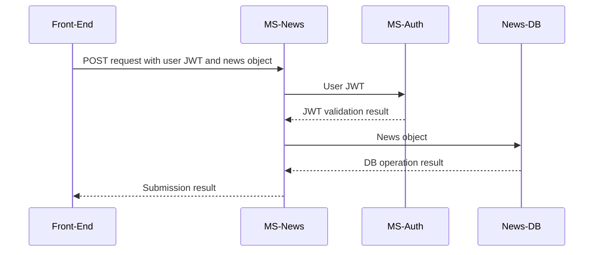

# BigfootDS Web App

A single-page application made in ReactJS.

Data fetched from various BigfootDS microservices.

- Translation (& hopefully localisation) via [react-18next](https://react.i18next.com/guides/quick-start)
- SPA routing via [React Router](https://reactrouter.com/en/main/start/tutorial)
- Local storage via [react-use](https://github.com/streamich/react-use)

## Pages

The routes accessible across the front-end application.

### /

Homepage, shows some general information about BigfootDS products.


### /about

"About Us" page, shows more information about BigfootDS such as its history and services.

Basically a static page.


### /games

"Games" page that shows more information about BigfootDS products.

Basically a static page.


### /news

TODO! Low-priority.

Should pull posts from the MS-News microservice.
Read-only for all but the admin users, who can do full CRUD on the website to manage and create news posts.

Interacts with MS-News.


### /account/:userId

Page to view account data.
Contains data from a combination of microservices, so this page must contain distinct components for those.

eg.
```
- /account/:userId
	- component to view data from MS-Auth specific to userId
	- component to view data from MS-Accounts specific to userId
```
Additionally, there is frontend logic to reveal editable forms.

- When user views their own account, edit/delete buttons appear on the relevant data
- When user views someone else's account, the viewed data is read-only

The back-end also has logic to prevent unauthorized edits, so the above logic is purely for UX.

### /account/:userId/:profileId/edit

Shows profile CRUD form.

Interacts with MS-Accounts.


### /account/register

Shows the auth register form.

Interacts with MS-Auth.


### /account/login

Shows the auth login form.

Interacts with MS-Auth.


## Contexts

Data managers across the front-end application.

### AuthContext

Data and CRUD interactivity with the MS-Auth microservice.

Uses a custom async reducer so that fetch requests can be used within reducer dispatch operations.

Bit of a doozy, this context does two things:

- manage sessions about the human using the front-end (eg. JWT management with the MS-Auth microservice)
- perform CRUD with the MS-Auth microservice

Manages two types of JWTs for different actions, as some actions should require a more-recent login.

For example, a user can log in once a month and stay logged in for general account data interactions, which uses the "long" JWT for a long-lived session. For more-sensitive operations such as changing a user's email address, a "short" JWT should be used to confirm that a real human logged in recently (as this would be a "short-lived" JWT).

And for CRUD operations, a valid JWT must be attached as well as whatever CRUD data is to be acted upon. 

For example, editing a user's email address would require both a short-lived JWT as well as a body of data including the email address.

For example, viewing a different user's data would require no JWT but does require a body of data including a target user ID.

### ProfileContext

Data and CRUD interactivity with the MS-Accounts microservice.

Uses a custom async reducer so that fetch requests can be used within reducer dispatch operations.

Manages profile data specified by routes in the front-end application, basically performing CRUD with the MS-Accounts microservice.

Most actions will require a valid JWT as well as profile-related body data, which the MS-Accounts microservice will automatically validate with MS-Auth.


### ThemeContext


### LanguageContext


## Security

Because this is a front-end, client-side-only web application - security is not bulletproof.

Meaning that there are forms and pages that are inaccessible based on client-side data.

Client-side data can always be edited, and should never be the "source of truth" for authentication or authorization.

So, the client-side data is never acted upon without server-side verification. 

For example, if a user "hacks" the browser to show a news CRUD form - something that is normally only accessible by admins - and makes a new news post using that form, the back-end microservice "MS-News" will receive the submission from that form. The "MS-News" microservice expects a JWT to be attached to the submission - and it passes that JWT onwards to "MS-Auth" for verification and refreshing. If "MS-Auth" says the JWT is invalid or if the JWT is associated with a user that does not have the correct permissions (no, the JWT does not store roles/permissions within it - just the user ID), "MS-News" halts its operation and returns an error to the front-end.

If "MS-Auth" said that the user specified in the JWT has the correct access permissions _and_ that the JWT is valid, a fresh JWT will be generated and returned to the previous layer (eg. "MS-News"). Then, "MS-News" can act upon the submission that it received.


