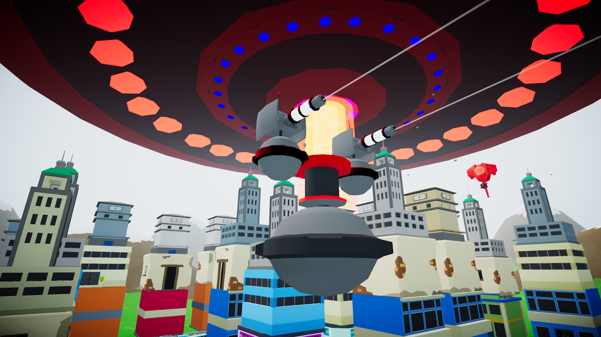
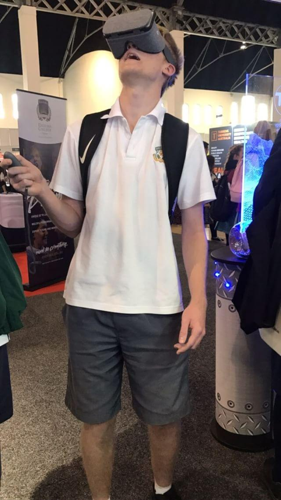
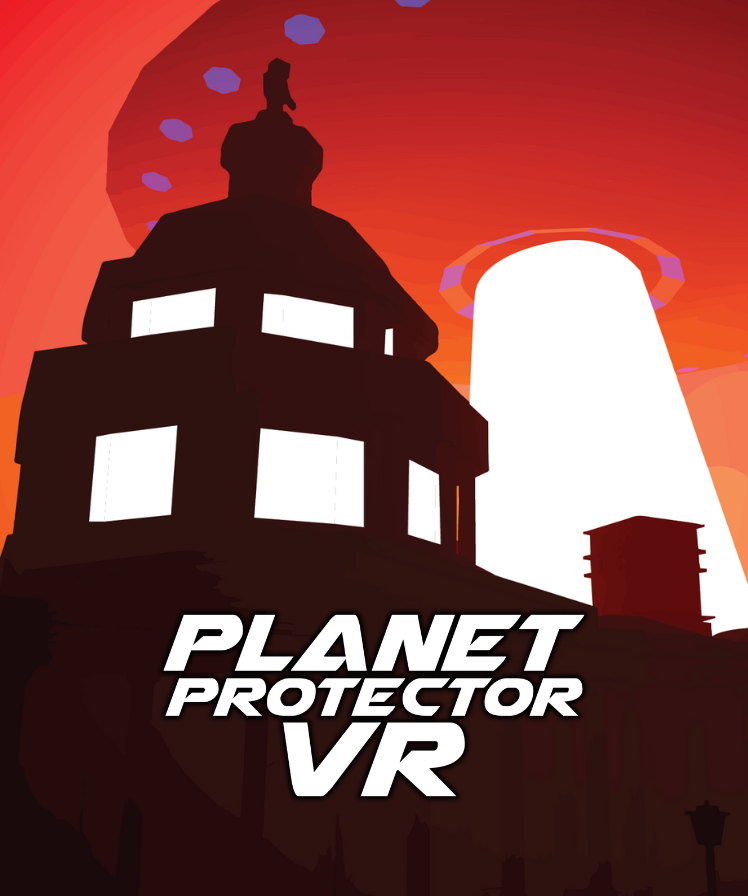

Defend your city from alien invaders in this colorful virtual reality game! Aim, shoot, and protect your planet for as long as you can in a variety of game modes & special missions!

Planet Protector VR puts you in command of the biggest & best turrets in the world, and it's up to you to fend off alien invaders through your favourite virtual reality headset & motion controllers.

Travel around the world to famous locations, complete special missions, or defend your own city in a variety of game modes.

## Quick Info

- [Available on Steam.](https://store.steampowered.com/app/656320/Planet_Protector_VR/)
- Compatible with HTC Vive, Oculus Rift, and Windows Mixed Reality virtual reality headsets.
- Released at an "early access" level in October 2017, and fully released in November 2020.
- Great for anyone new to gaming or casually gaming, and anyone new to virtual reality.
- Low or no motion sickness, since the player remains stationary in their cannon-controlling tower.

## History

Planet Protector VR began as a student project named "Planet Defender" in late 2015, created by Alex Holder during his Bachelor of Interactive Media studies at the Academy of Interactive Technology (AIT). In the initial prototype, you defended a small city against invading aliens from afar, using your mouse & keyboard to control the game. It was deemed an "okay" game, but just felt like it was missing a special something.

Then, in late 2016, Alex joined the Academy of Interactive Entertainment's (AIE) Graduate Diploma of Management to get into the AIE Incubator Program. After a couple of months of prototyping various game ideas, Planet Defender was thrown into a Google Daydream headset and adjusted to use the Daydream motion controller - and it was like striking gold. Renaming the project to Planet Protector VR, this new iteration of the game was found to be much more engaging & interesting to all who played it. Being right in the middle of the city, having everything explode all around you, and seeing gigantic UFOs loom over you - it all became so much better thanks to virtual reality!

Throughout 2017, Planet Protector VR was constantly worked on & shown off at various expos & events in the greater Sydney region. BigfootDS has been involved in various education & general exhibitions and conventions to showcase new technology to a very different variety of demographics, and Planet Protector VR has been shown at dozens of events throughout 2017.  

This culminated with the game releasing at an "early access" level on Steam and Google Play, compatible with Google Daydream, Windows Mixed Reality, HTC Vive, and Oculus Rift headsets and their accompanying controllers.

The game had become a great tool to show new people virtual reality, being developed to become suitable for all age groups & demographics. While more intense competitors of this game may be more complex & deep in the long-term & great for gamers, they lose a huge chunk of players in target markets such as children & older adults - the non-gamers have been seen to pick up Planet Protector VR much more easily, so BigfootDS has doubled-down on that unique attribute to improve Planet Protector VR even further.

This project had become a tool that BigfootDS uses to introduce virtual reality to people of all demographics, getting people outside of the gaming market to adopt virtual reality through simple gameplay & engaging visuals. Planet Protector VR's ability to be played on all VR headsets that use motion controllers allowed it to become a great stepping stone to introduce people to the wider world of virtual reality.

Since Planet Protector VR was being made for so many platforms, devices, and storefronts, it was decided to give it a staggered release. This allowed BigfootDS to perform further testing on the game, create new content per player feedback, and improve compatibility with new & upcoming devices and platforms. 

However, as the virtual reality hype simmered down, those other platforms became less financially viable to build for. At various stages of this project, the game was running on the HTC Vive Focus, the Nintendo Labo, and Microsoft's Mixed Reality headsets - but much like how Google shuttered its own Google Daydream system, the other systems shuttered or had silently faded from public attention. 

Even a partnership with Smilegate for their VR arcade system, "Stove VR", fizzled - the game got localised into Korean, builds were sent back to Smilegate, and then all communications from their representatives stopped! 

So, it stopped being financially viable to continue work on this game. 

As of 2020, Planet Protector VR entered the "sunset" - development ceased.

